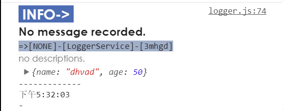
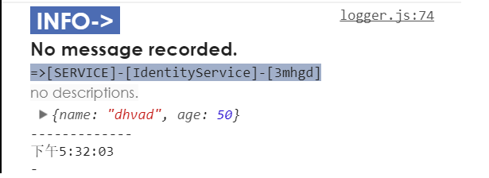
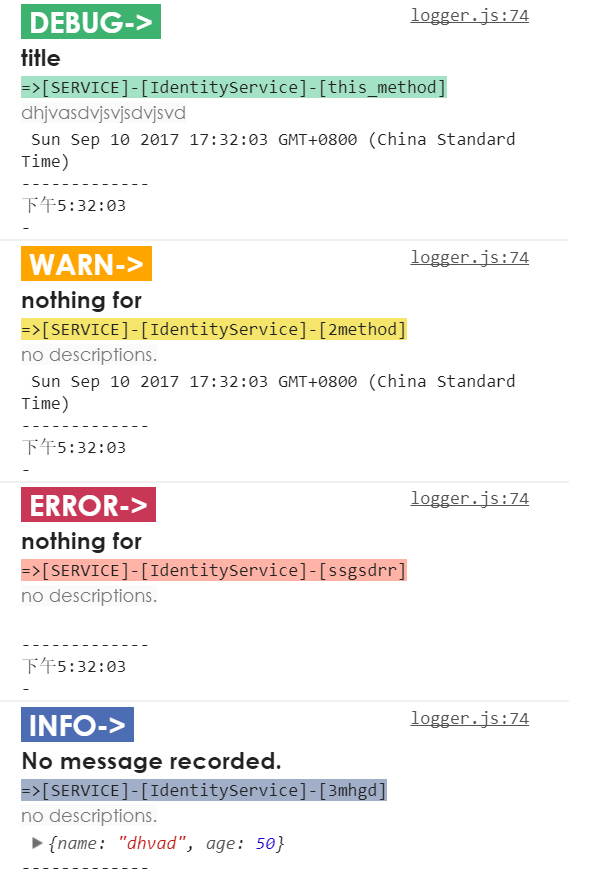

# ws-logger : LoggerService for angular4
Easy logger through ES5/Typescript with injectable service.

This is a library to make logger service more powerful. 
There are 4 level and each level' consola-print has its colors and styles, also support to custom them.

## Add the package into your project
```npm
npm install ws-logger --save
```
This package also need my regex package "ws-regex", it will be add in automatically, but try to add it if any mistake.
```npm
npm install ws-regex --save
```

## The injection work

```typescript
import { LoggerService, LOGGER_SERVICE_CONFIG } from 'ws-logger';

/*close debug mode and details for production mode if need. */
let level = 0;
let isProd = false;
if (environment.production) {
  level = 1;
  isProd = true;
}

// ...
@NgModule({
  declarations: [
   // ...
  ],
  imports: [
    // ...
  ],
  providers: [
    // ...
    /* provide config for logger service if need. */
    { provide: LOGGER_SERVICE_CONFIG, useValue: { Level: level, IsProduction: isProd } },
    /*you should add service here.*/
    LoggerService
  ],
  bootstrap: [RootComponent]
})
export class AppModule { }
```
Then you can get the singleton service anywhere you need by constructor-injection:
```typescript
    constructor(private lgsrv: LoggerService) {
        this.lgsrv.Info({ name: 'dhvad', age: 50 }, '3mhgd');
    }
```
And you will see the message in the console of broswer:


Anyway, it's a simple way to use logger service because it's impossible to get the file location and the component name.
 Typescript has no metedata in runtime and the service is in singleton mode.

 ## Use in logger instance
 You can get more powerful logger features by call GetLogger\<T>(...):
 ```typescript
    private logger: Logger<IdentityService>;

    constructor(private lgsrv: LoggerService) {
        this.logger = lgsrv.GetLogger(IdentityService).SetModule('service')
        this.logger.Info({ name: 'dhvad', age: 50 }, '3mhgd');
    }
 ```
 And you will see the message in the console of broswer:


You can show the file position in color grid.

## More styles and levels
 ```typescript
        this.logger.Debug(['title', 'dhjvasdvjsvjsdvjsvd', new Date()], 'this_method');
        this.logger.Warn(['nothing for', new Date()], '2method');
        this.logger.Error('nothing for', 'ssgsdrr');
        this.logger.Info({ name: 'dhvad', age: 50 }, '3mhgd');
 ```


I will provide methods for custom-styles and more features later.